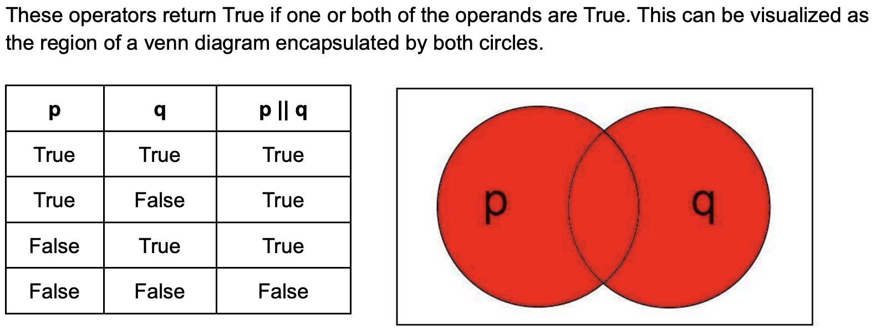
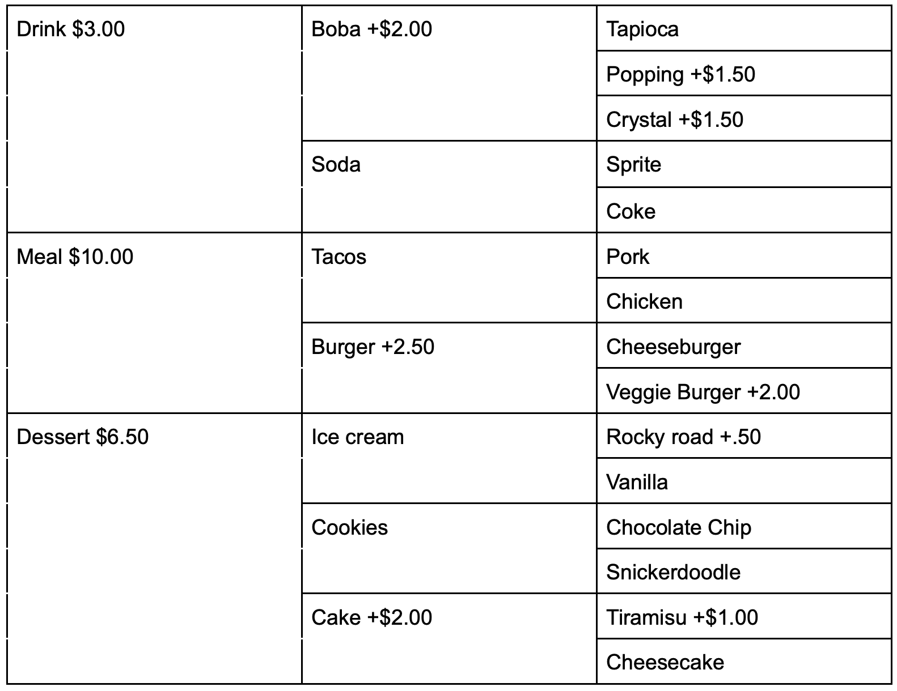
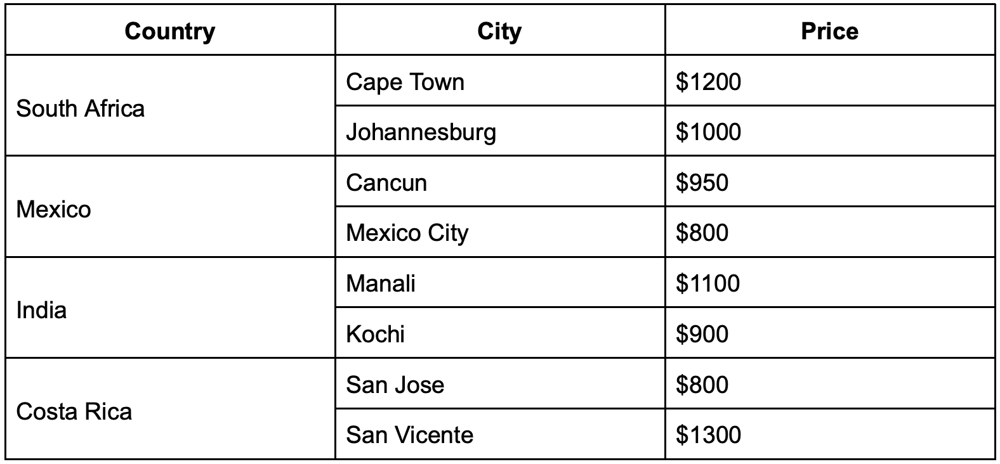

#### **CSCI 1300 CS1: Starting Computing: Homework 2**
#### **Angel - Summer 2022**
#### **Due: Saturday, June 11 by 11:59pm MST**
<br/>

# Table of contents
1. [Objectives](#objectives)
2. [Background](#background)
4. [Questions](#questions)
    1. [Question 1](#question1)
    2. [Question 2](#question2)
    3. [Question 3](#question3)
    4. [Question 4](#question4)
    5. [Question 5](#question5)
    6. [Question 6](#question6)
    7. [Question 7](#question7)
    8. [Extra Credit 1](#ec1)
5. [Submission Instructions](#submissions)
   1. [Checklist](#checklist)
6. [Grading rubric](#grading)


# Objectives <a name="objectives"></a>

* Compile and run C++ code 
* Understand how to implement decisions using if statements in C++


# Background <a name="background"></a>
## Conditional Statements
Conditional statements, also known as decision or branching statements, are used to make a decision using a condition. A condition is an expression that evaluates to a boolean value, either true or false. [Conditional Execution in C++](https://cal-linux.com/tutorials/conditionals.html) is a good online resource for learning about conditionals in C++.

**IF Statements:** An if statement in C++ is composed of a condition and a body. The body is executed only if the condition is true. The condition appears inside a set of parentheses following the keyword “if” and the body appears within a set of curly brackets after the condition:

The general format for **if statements** is:
```
if (<CONDITION>)
{
	<BODY>
}
```

It is good practice to vertically align the open ( **{** ) and closed ( **}** ) curly brackets and to indent the body.

The condition is interpreted as a boolean value, either true or false. Be careful, most expressions in C++ have such an interpretation. For instance, non-zero numeric values are true. Assignment operations (single equal sign) are interpreted as true as well. A common mistake is to use a single equals sign inside a condition when a double equals sign is intended.

Unintended behavior when accidentally using assignment operation (= instead of ==) in conditional:
```cpp
int x = 5;
if (x = 1) // one equal sign
{
	cout << “The condition is true.” << endl;
}
cout << "x is equal to " << x << endl;
```
Example output:
<pre>
The condition is true.
x is equal to 1
</pre>

What you **actually** mean to do:
```cpp
int x = 5;
if (x == 1) // two equal signs
{
	cout << “The condition is true.” << endl;
}
cout << "x is equal to " << x << endl;
```
Example output:
<pre>
x is equal to 5
</pre>

Remember, “=” is for assignment and “==” is for checking equality.

**IF-ELSE Statements:** If statements may be paired with else statements in C++. If the condition associated with the if statement is false, the body associated with the else statement is executed. The else statement body is enclosed in a set of curly brackets:
```
if (<CONDITION>)
{
	<BODY>
}
else
{
	<BODY>
}
```
While an if statement does not need an else statement, there must be an if statement before every else statement.

**ELSE-IF Statements:** Finally, an if statement may also be associated with any number of else-if statements. These statements each have an associated condition and an associated body. The body is executed if the condition is true and the conditions for all preceding if statements and else-if statements in the same group are false. An else statement may be included at the end of the group but is not required. The else statement will be executed if all the previous conditions are false. 

```
if (<CONDITION>)
{
	<BODY>
}
else if (<CONDITION>)
{
	<BODY>
}
else
{
	<BODY>
}
```

**Some examples:**

- If the int num is negative, print “Changing sign” and make it positive.
```cpp
if (num<0)
{
	cout << “Changing sign” << endl;
	num = -1 * num;
}
```
- If the int num is 0, print “Can’t divide by 0!”. Otherwise, set num to num divided by 2.
```cpp
if (num==0) //notice the double equals!
{
	cout << “Can’t divide by 0!” << endl;
}
else
{
	num = num/2; //integer arithmetic
}
```
- If the int num is greater than 0 and less than 10, set num to 5 times itself. Otherwise, if num is greater than 100, set num to itself divided by 10.
```cpp
if (num>0 && num<10)
{
	num = 5*num;
}
else if (num > 100)
{
	num = num/10;
}
```
- Print “Positive” if the int num is positive, “Zero” if it is 0, and “Negative” if it is negative. Both of the approaches below work. Why? Can you think of other ways to achieve the same result?

Approach 1:
``` cpp
if ( num > 0 )
{
	cout << “Positive” << endl;
}
else if ( num == 0 )
{
	cout << “Zero” << endl;
}
else if ( num < 0 )
{
	cout << “Negative” << endl;
}
```
Approach 2:
```cpp
if ( num > 0 )
{
	cout << “Positive” << endl;
}
else if ( num == 0 )
{
	cout << “Zero” << endl;
}
else
{
	cout << “Negative” << endl;
}
```
- Let score be an int between 0 and 100. Print the letter grade associated with score (A: 90-100, B: 80-89, C: 70-79, D: 60-69, F: 0-59)
```cpp
if (score>= 90 && score<=100)
{
	cout << “A” << endl;
}
else if (score>=80 && score<=89)
{
	cout << “B” << endl;
}
else if (score>=70 && score<=79)
{
	cout << “C” << endl;
}
else if (score>=60 && score<=69)
{
	cout << “D” << endl;
}
else if (score>=0 && score<=59)
{
	cout << “F” << endl;
}
```


## Switch Statements

Switch case statements are a substitute for long if statements that compare a variable to several values.


### Syntax
With the switch statement, the variable name is used once in the opening line. A case keyword is used to provide the possible values of the variable, which is followed by a colon and a set of statements to run if the variable is equal to a corresponding value.

An example of a simple switch statement:
```cpp
switch (n){
     case 1:
          // code to be executed if n == 1;
          break;
     case 2:
          // code to be executed if n == 2;
          break;
     default:
          // code to be executed if n doesn’t match any cases
}
```

**Important notes to keep in mind while using switch statements :**
- The expression provided in the switch should result in a constant value otherwise it would not be valid.
    - switch(num)
        - allowed (num is an integer variable)
    - switch(‘a’)
        - allowed (takes the ASCII Value)
    - switch(a+b)
        - allowed,where a and b are int variable, which are defined earlier
- The **break** statement is used inside the switch to terminate a statement sequence. When a break statement is reached, the switch terminates, and the flow of control jumps to the next line following the switch statement.
- The break statement is optional. If omitted, execution will continue on into the next case. The flow of control will fall through to subsequent cases until a break is reached.
- The **default** statement is optional. Even if the switch case statement does not have a default statement, it would run without any problem.

## Relational Operators

A relational operator is a feature of a programming language that tests or defines some kind of relation between two entities. These include numerical equality (e.g., 5 == 5) and inequalities (e.g., 4 ≥ 3). Relational operators will evaluate to either True or False based on whether the relation between the two operands holds or not. When two variables or values are compared using a relational operator, the resulting expression is an example of a boolean condition that can be used to create branches in the execution of the program. Below is a table with each relational operator’s C++ symbol, definition, and an example of its execution.

||||
|-----|-----|-----|
|>|greater than|5 > 4 is TRUE| 
|<|less than|4 < 5 is TRUE| 
|>=|greater than or equal|4 >= 4 is TRUE| 
|<=|less than or equal|3 <= 4 is TRUE| 
|==|equal to|5 == 5 is TRUE| 

## Logical Operators

Logical operators are used to compare the results of two or more conditional statements, allowing you to combine relational operators to create more complex comparisons. Similar to relational operators, logical operators will evaluate to True or False based on whether the given rule holds for the operands. Below are some examples of logical operators and their definitions.

- && (AND) returns true if and only if both operands are true
- || (OR) returns true if one or both operands are true
- ! (NOT) returns true if an operand is false and false if the operand is true

### Truth tables

Every logical operator will have a corresponding truth table, which specifies the output that will be produced by that operator on any given set of valid inputs. Below are examples of truth tables for each of the logical operators specified above.

**AND ( && ):**
These operators return true if and only if both operands are True. This can be visualized as a venn diagram where the circles are overlapping.


**OR ( || ):**
These operators return True if one or both of the operands are True. This can be visualized as the region of a venn diagram encapsulated by both circles.



## Coding Style

### Whitespace and indentation

**Whitespaces:** Whitespace can set things off and reduce the strain on the reader's eyes. Because the compiler ignores whitespace, you're free to place things anywhere you want and format it however you want. Whitespace can come in several forms, including indentation.

**Indenting:** Increase your indentation by one increment of each brace {, and decrease it once on each closing brace }. Place a line break after every {. Use Tab to increase indent and Shit+Tab to decrease indentation.

**Bad Example:** There is no indentation and it is difficult to see where different portions of the code start and stop.
```cpp
int main(){
int number = 0;
while(number < 10){
if(number < 5){
cout << "Less than 5" << endl;
}else{
cout << "Greater than 5" << endl;
}
number++;
}
}
```
Good Example: There is proper indentation and the code is easier to read.
```cpp
int main() {
    int number = 0;
    while(number < 10) {
        if(number < 5) {
            cout << "Less than 5" << endl;
        }
        else {
            cout << "Greater than 5" << endl;
        }
        number++;
    }
}
```

### Naming and variables
**Names:** Give variables descriptive names, such as firstName or homeworkScore. Avoid one-letter names like a or x, except for loop counter variables such as i.

Bad Example:
```cpp
int thing = 16;
double a = 2.2;
string x = "Michael";
```

Good Example:
```cpp
int cupsPerGallon = 16;
double lbsPerKilo = 2.2;
string firstName = "Michael";
```
**Capitalization:** Name variables and functions with “lower camel-casing”, where the first letter is lowercase and all subsequent words in the name start with a capital letter.

Bad Example:
```cpp
int numberbananas = 10;
double NumberFish = 7;
string AGEOFPERSON = "Michael";
```
Good Example:
```cpp
int numberBananas = 10;
double numberFish = 7;
string ageOfPerson = "Michael";
```
### Comments
* Your code should be well-commented. Use comments to explain what you are doing, especially if you have a complex section of code. These comments are intended to help other developers understand how your code works. These comments should begin with two backslashes (//) or the multi-line comments (/* … comments here… */) .

* Examples:
    *  Single-line:
    ```cpp
    // CSCI 1300 Summer 2022
    ```
    * Multi-line:
    ```cpp
    /*
    Algorithm:
    Input: two numbers
    Output: sum of input numbers

    1. Ask the user to enter a number
    Save in variable number_1
    2. Ask the user to enter a number
    Save in variable number_2
    3. Compute sum 
    sum = number_1 + number_2
    4. Display sum to user
    */
   ```
## Looooooooop

**While Loops**

*Loops* allow us to run a section of code multiple times. They will repeat execution of a single statement or 
group of statements as long as a specified condition continues to be satisfied. If the condition is not true, 
then the statement will not be executed. 

*Syntax of a while loop*
```cpp
while (condition)
{
	//statement(s) to do something;
}
```
Here, `while` is a C++ reserved word, *condition* should be a Boolean expression that will evaluate to either **true** or **false**, and *statement(s) to do something* is a set of instructions enclosed by curly brackets. If the condition is **true**, then the specified statement(s) within the loop are executed. After running once, the Boolean expression is re-evaluated. If the condition is **true**, the specified statement(s) are executed again. This process of evaluation and execution is repeated until the condition becomes **false**.

**Example 1**
```cpp
int userChoice = 1;
while (userChoice != 0)
{
   cout << “Do you want to see the question again? “ << endl; 
   cout << “Press 0 if no, any other number if yes.” << endl;
   cin >> userChoice;
}
```

Entering ‘0’ will terminate the loop, but any other number will cause the loop to execute again.  **Note how we must initialize the condition before the loop starts.** Setting `userChoice = 1` ensures that the while loop will run at least once.

**Example 2** <a name="whileExample2"></a>
```cpp
int i = 0; 
while (i < 5)
{
	cout << i << endl;
	i = i + 2;
}
```
Notice how you must manually initialize `i=0` and then manually increment `i` by 2. 
Inserting `cout` statements into your loops is a quick way to debug your code if something isn’t working, to make sure the loop is iterating over the values you want to be using. A common error is to forget to update `i` within the loop, causing it to run forever.

**For loop**

Sometimes you know the exact number of iterations that a loop has to perform. In these cases a `for` loop comes into use. It has three elements: 
* *Initialization*: It must initialize a counter variable to a starting value. 
* *Condition*: If it is true, then the body of the loop is executed. If it is false, the body of the loop does not execute and jumps to the next statement(s) just after the loop.
* *Update*: Updates the counter variable during each iteration  

*Syntax of a for loop*
```cpp
for (initialization; condition; update)
{
	//statement(s) to do something;
}
```

**Example 1:**  
```cpp
for (int count = 0; count < 5; count++)
{
	cout << “hello” << endl;
}
```
Notice the following three parts of the `for` loop:
 * `count` is initialized to `0`, 
 * the test expression is `count < 5` 
 * `count++` to increment the count value by one

**Example 2:**
```cpp
for (int i = 0; i < 5; i = i + 2)
{
	cout << i << endl;
}
```
Notice that this example behaves in the same way as the [example 2](#whileExample2) in the `while` loop section above.  


# Questions <a name="questions"></a>

## **Question 1 (4 points): Lottery Ticket** <a name="question1"></a>

Write a C++ program that will determine whether you are old enough to buy a lottery ticket. The legal age to do so is 18.

The program should take an integer input from the user and display one of the two phrases to the user (unless input is invalid).

Sample run:
<pre>
How old are you?
<b>17</b>
You cannot buy a lottery ticket yet.
</pre>
<pre>
How old are you?
<b>23</b>
You can buy a ticket! Good luck.
</pre>

Make sure your program does basic input validation. A person cannot have a negative age. If the user inputs a negative value, print `Please enter a valid input.` and exit the program.

Make sure to submit your code on Coderunner (accessed through Canvas) as well as the final Zip file submission.

The file should be named _lotteryTicket.cpp_


## **Question 2 (5 points): Amusement Park** <a name="question2"></a>
You're having a family reunion this weekend and they want to go an amusement park! There are three rides they're interested in: the carousel, the teacups, and the new extra scary roller coaster, The Inferno. Since you've last seen your family, there have been some new additions and the kids have grown. Can you create a program that will take the height of a given family member and the ride they want to take and tell them whether they are allowed to take it or not?

The program should take a non-negative number (_double_) and character input from the user and display one of the two phrases to the user (unless input is invalid).

|Ride|Minimum Height (inches)|
|----|----|
|The carousel|30|
|The teacups|36|
|The Inferno|45|

Sample run:
<pre>
How tall are you in inches?
<b>42</b>
What ride would you like to take(c, t, or i)?
<b>t</b>
Yes, you are allowed to go on that ride!
</pre>
<pre>
How tall are you in inches?
<b>20.6</b>
What ride would you like to take(c, t, or i)?
<b>i</b>
Sorry, you cannot go on that ride.
</pre>

Ensure to do input validation. For example, the height the user puts in should be a number. The user should also only input either c, t, or i. Whenever the user inputs something that is not allowed, the program should exit and print: ` Please enter a valid input. `

Make sure to submit your code on Coderunner (accessed through Canvas) as well as the final Zip file submission.

The file should be named _amusementPark.cpp_

## **Question 3 (5 points): Rubber ducks** <a name="question3"></a>

You have a very large pool that you want to fill with rubber ducks. The store you're placing the order for gives a discount if you buy the ducks in bulk. There are 4 brackets of discounts. If you buy 20 ducks or less, there is no discount. If you buy more than 20 but less than or equal to 100, you get 10% off your order. If you buy more than a 100 but 500 or less, you get a 20% discount. Anything more will give you half off. Each duck is 50 cents. Give your order total in dollars. 

The input should be a non-negative integer and the output should be a double.

Sample run:
<pre>
How many ducks would you like to order?
<b>24</b>
Your total is $10.80
</pre>

**Note:** The total cost should be formatted with a two-digit precision. You can use the setprecision() function with the fixed manipulator from `<iomanip>` library to do so.

Bad formatting: `10.8`

Good formatting: `$10.80`

Ensure you are doing input validation and similar to the last question. If the user inputs something they cannot, output ` Please enter a valid input. ` and exit.

Make sure to submit your code on Coderunner (accessed through Canvas) as well as the final Zip file submission.

The file should be named _ducks.cpp_

## **Question 4 (10 points):  Stock Prices** <a name="question4"></a>

You've taken note of your favorite stock's price over the past 3 weeks and want to see whether the price is increasing, decreasing, or neither. If your stocks are sorted and increasing, then print out “The value is rising!”. If they are sorted and decreasing, then print “The value is tanking.”. If its neither or if two or more prices are the same, then print "Neither". 

The user should input 3 non-negative numbers (_double_) separated by spaces. 

Sample runs:
<pre>
Enter stock prices over last 3 weeks
<b>162 180 225</b>
The value is rising!
</pre>

<pre>
Enter stock prices over last 3 weeks
<b>3.5 2.2 1.9</b>
The value is tanking.
</pre>

<pre>
Enter stock prices over last 3 weeks
<b>162 135 225</b>
Neither
</pre>

Ensure you are doing basic input validation, output ` Please enter a valid input. ` if the user inputs a negative stock price.

Make sure to submit your code on Coderunner (accessed through Canvas) as well as the final Zip file submission.

The file should be named as _stocks.cpp_ 

## **Question 5 (15 points): Restaurant Order** <a name="question5"></a>

You want to create a program for your family restuarant that can take orders from customers and tell them the price of their dish. The dishes at your restaurant are very customizable, and the pricing can be confusing and hard to keep track of. This program will hopefully help! 

The menu and the customizations are as follows:


The user should input an integer in the range of the choices you give them (for example, a user cannot input 3 if you only have 2 choices) and in response should be prompted to for the next set of choices. Once they make the final selection, the order total should be printed to them as a double with proper formatting as shown in the sample run.

Sample run:
<pre>
What would you like? 1.Drink 2.Meal 3.Dessert
<b>1</b>
Select one: 1.Boba 2.Soda
<b>1</b>
Select one: 1.Tapioca 2.Popping 3.Crystal
<b>2</b>
Order total is $6.50
</pre>

Ensure you are doing input validation, output ` Please enter a valid input. ` if the user inputs something they cannot and exit the program.

Example of input validation:
<pre>What would you like? 1.Drink 2.Meal 3.Dessert
<b>5</b>
Please enter a valid input. 
</pre>

Make sure to submit your code on Coderunner (accessed through Canvas) as well as the final Zip file submission.

The file should be named as _order.cpp_. 


## **Question 6 (15 points): Vacation Package - switch statements only** <a name="question6"></a>

**Use only switch statements instead of if-else statements. If-else statements will not be accepted for this problem.**

You want to go on a vacation this summer break but need to figure out how much it's going to cost. You travel agent gave you the following quote:



Write a menu-driven program that asks user input of country, then city and gives the user the price. 

The user should input an integer in the range of the choices you give them (for example, a user cannot input 3 if you only have 2 choices) and in response should be prompted to for the next set of choices. Once they make the final selection, the total should be printed to them as an integer with proper formatting as shown in the sample run.

Sample run:
<pre>
Enter country: 1.South Africa 2.Mexico 3.India 4.Costa Rica
<b>4</b>
Enter city: 1.San Jose 2.San Vicente
<b>2</b>
Your trip will be $1300.
</pre>

Ensure you are doing input validation, output ` Please enter a valid input. ` if the user inputs something they cannot and terminate the program.

Make sure to submit your code on Coderunner (accessed through Canvas) as well as the final Zip file submission.

The file should be named as _vacation.cpp_. 

## Question 7 (6 points): Sum positive multiples of 3 <a name="question7"></a>

Write a program that asks the user for a **positive integer** as input and computes the sum of all multiples of 3 between 0 and the value entered (inclusive of the entered value).

If the user enters a negative number as input, print “Invalid input.”

*Sample run 1:*
<pre><code>Enter a positive integer:
<b>20</b> 
Sum: 63
</code></pre>

*Sample run 2:*
<pre><code>Enter a positive integer:
<b>-1</b> 
Invalid input.
</code></pre>

The file should be named as **sumThrees.cpp**. Don’t forget to head over to Coderunner on Canvas and paste your solution in the answer box! 

## **Extra Credit: Question 1 (3 points): Convert length** <a name="ec1"></a>
In this course, students need to have an average score of at least 67 on practicums to earn C- or higher letter grades. It would be useful to write a program to calculate your practicum average. The average of a list of numbers is defined as the sum of the numbers divided by how many numbers are in the list. 

Write a program that asks the user to enter three practicum scores (non-negative integers) and then it calculates the average score. Then, it prints the average score(_double_) and prints a message based on the average score.  

If the calculated average score is 67 or higher, then it prints
“You have a passing practicum average.”
If the average is below 67, then it prints 
“You can retake practicums during the final.”

Note: The average should be formatted with a two-digit precision as shown below. You can use the setprecision() function with the fixed manipulator from `<iomanip>` library to do so.

Sample run:
<pre>
Enter practicum 1 score:
<b>90</b>
Enter practicum 2 score:
<b>85</b>
Enter practicum 3 score:
<b>75</b>
Practicum average: 83.33
You have a passing practicum average.
</pre>

Ensure you are doing basic input validation, output ` Please enter a valid input. ` if the user inputs something they cannot and exit the program.

The file should be named as _practicum.cpp_. 

Don’t forget to head over to the Homework 2 - Coderunner (extra credit) on Canvas and paste your solution in the answer box!


# Submission Instructions <a name="submissions"></a>

## Code runner

The correctness of your program will be graded by Coderunner. You can modify your code and re-submit (press “Check” again) as many times as you need to, until the assignment due date. You can find Coderunner on the page titled Homework 2 - Coderunner in the Week 4 Module. 

## Canvas zip file
* **C++ files**. All files should be named as specified in each question, and they should compile and run on VSCode to earn full points. TAs will be grading the style of your code and comments. Please see the coding style under the [background](#background) section. At the top of each file, write your name with the following format:</br>
```cpp
// CSCI 1300 Summer 2022
// Author: Punith Sandhu
// Recitation: 123 – TA name
// Homework 2 - Problem # …
```
Example submission:
```cpp
// example_1.cpp

// CSCI 1300 Summer 2022
// Author: Punith Sandhu
// Recitation: 123 – TA name
// Homework 2 - Problem # ...

#include <iostream>

using namespace std;

int main() {

    int num = 10;
    cout << num << endl;

    return 0;
}
```

When you are finished with all the questions, zip all files. Submit the zip file under the assignment Homework 2 on Canvas.

## Checklist <a name="checklist"></a>
Here is a checklist for submitting the assignment:
1. Use your solutions in VS Code to complete the **Homework 2 - Coderunner** assignment on Canvas (Modules → Week 2). 
    * For additional extra credit, submit the extra credit question to **Homework 2 - Coderunner** (Extra Credit).
2. Submit one zip file to the **Homework 2** assignment on Canvas. The zip file should be named, **hmwk2_lastname.zip**. It should have the following 6 files: 
    * lotteryTicket.cpp
    * amusementPark.cpp
    * ducks.cpp
    * stocks.cpp
    * order.cpp
    * vacation.cpp
    * sumThrees.cpp
    * Extra-credit: practicum.cpp

# Grading Rubric <a name="grading"></a>

| **Criteria**                                | Points |
| ------------------------------------------- | ------ |
| Question 1                  | 4     |
| Question 2                  | 5     |
| Question 3                  | 5     |
| Question 4                  | 10     |
| Question 5                  | 15     |
| Question 6                  | 15     |
| Question 7                  | 6     |
| Total                                       | 60     |
| Extra Credit - Question 1                | 3     |
