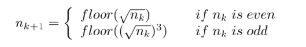
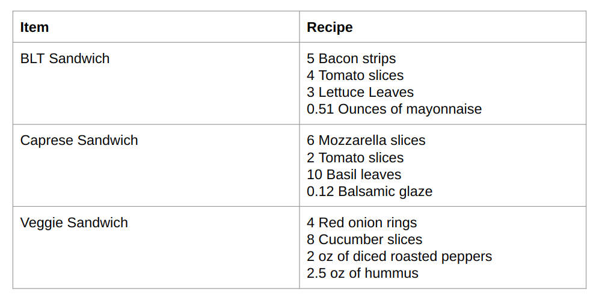

#### **CSCI 1300 CS1: Starting Computing: Homework 3**
#### **Rege - Summer 2022**
#### **Due: Saturday, June 18th, by 11.59pm MST**

<br/>

# Table of contents

1. [Objectives](#objectives)
2. [Background](#background)
4. [Questions](#questions)
    1. [Question 1](#question1)
    2. [Question 2](#question2)
    3. [Question 3](#question3)
    4. [Question 4](#question4)
    5. [Question 5](#question5)
    6. [Extra Credit](#ec1)
5. [Submission Instructions](#submissions)
    1. [Checklist](#checklist)
6. [Grading rubric](#grading)

# Objectives <a name="objectives"></a>

* Understand loops
* Understand C++ loops: while loops, for loops, do-while loops

# Background <a name="background"></a>
## Looooooooop

**While Loops**

*Loops* allow us to run a section of code multiple times. They will repeat execution of a single statement or
group of statements as long as a specified condition continues to be satisfied. If the condition is not true,
then the statement will not be executed.

*Syntax of a while loop*
```cpp
while (condition)
{
	//statement(s) to do something;
}
```
Here, `while` is a C++ reserved word, *condition* should be a Boolean expression that will evaluate to either **true** or **false**, and *statement(s) to do something* is a set of instructions enclosed by curly brackets. If the condition is **true**, then the specified statement(s) within the loop are executed. After running once, the Boolean expression is re-evaluated. If the condition is **true**, the specified statement(s) are executed again. This process of evaluation and execution is repeated until the condition becomes **false**.

**Example 1**
```cpp
int userChoice = 1;
while (userChoice != 0)
{
   cout << “Do you want to see the question again? “ << endl;
   cout << “Press 0 if no, any other number if yes.” << endl;
   cin >> userChoice;
}
```

Entering ‘0’ will terminate the loop, but any other number will cause the loop to execute again.  **Note how we must initialize the condition before the loop starts.** Setting `userChoice = 1` ensures that the while loop will run at least once.

**Example 2** <a name="whileExample2"></a>
```cpp
int i = 0;
while (i < 5)
{
	cout << i << endl;
	i = i + 2;
}
```
Notice how you must manually initialize `i=0` and then manually increment `i` by 2.
Inserting `cout` statements into your loops is a quick way to debug your code if something isn’t working, to make sure the loop is iterating over the values you want to be using. A common error is to forget to update `i` within the loop, causing it to run forever.

**For loop**

Sometimes you know the exact number of iterations that a loop has to perform. In these cases a `for` loop comes into use. It has three elements:
* *Initialization*: It must initialize a counter variable to a starting value.
* *Condition*: If it is true, then the body of the loop is executed. If it is false, the body of the loop does not execute and jumps to the next statement(s) just after the loop.
* *Update*: Updates the counter variable during each iteration  

*Syntax of a for loop*
```cpp
for (initialization; condition; update)
{
	//statement(s) to do something;
}
```

**Example 1:**  
```cpp
for (int count = 0; count < 5; count++)
{
	cout << “hello” << endl;
}
```
Notice the following three parts of the `for` loop:
 * `count` is initialized to `0`,
 * the test expression is `count < 5`
 * `count++` to increment the count value by one

**Example 2:**
```cpp
for (int i = 0; i < 5; i = i + 2)
{
	cout << i << endl;
}
```
Notice that this example behaves in the same way as the [example 2](#whileExample2) in the `while` loop section above.  


**Strings**

In C++, `string` is a data type just like `int` or `float`. Strings, however, represent sequences of characters instead of a numeric value. A string literal can be defined using double quotes (" "). So *“Hello, world!”*, *“3.1415”*, and *“int i”* are all strings. We can access the character at a particular location within a string by using square brackets, which enclose an *index* which you can think of as the *address* of the character within the string. Importantly, strings in C++ are indexed starting from zero. This means that the first character in a string is located at index 0, the second character has index 1, and so on. For example:
```cpp
string s = “Hello, world!”;
cout << s[0] << endl;  //prints the character ‘H’ to the screen
cout << s[4] << endl;  //prints the character ‘o’ to the screen
cout << s[6] << endl;  //prints the character ‘ ’ to the screen
cout << s[12] << endl; //prints the character ‘!’ to the screen
```

There are many useful functions available in C++ to manipulate strings. One of the simplest is `length()`.
The syntax for using `length()` function is:
<pre><code>s.length()</code></pre>

*Example 1*
```cpp
string s = “Hello, world!”;
cout << s.length() << endl;			//This will print 13
for (int i = 0; i < s.length(); i++)
{
	cout << s[i] << endl;
}
```

The above example will print each character in the string “Hello, world!” to the screen one per line. Notice how the `length()` function is used to determine the number of characters in a string. This allows us to loop over a string character by character (*i.e. traverse the string*).


*Common mistakes in using length() function:*
<pre><code>length(s)
s.length
</code></pre>
This is a special kind of function associated with objects, usually called a *method*, which we will discuss later in the course.

**Let's think about:**
What happens in the above code snippet if we try to print characters beyond the length of the string? In particular, what happens when we replace `s.length()` with `s.length()+3` in the above `for` loop?


# Questions <a name="questions"></a>

## Question 1 (8 points): String capitalization <a name="question1"></a>

Write a C++ program to flip the case of each letter in a given string i.e. if there is a lower case character make it upper case and vice versa. Print the output.

Note: The input string can have non-alphabetic characters. These should be left unchanged.

*Hint:* See the cctype header for helper functions. Recall functions like 'isalpha()' and 'islower()' covered in class.

P.S. You might face issues with assigning string.length() to integers. This is a weird quirk in Coderunner. You can force the output of string.length() to an integer via static_cast<int>  

*Sample run 1:*
<pre><code>Enter the string:
<b>#Programming#</b>
#pROGRAMMING#
</code></pre>

*Sample run 2:*
<pre><code>Enter the string:
<b>HellO wOrld</b>
hELLo WoRLD
</code></pre>

The file should be named **flipCase.cpp**. Don’t forget to head over to Coderunner on Canvas and paste your solution in the answer box!


## Question 2 (10 points): Print mathematical sequence <a name="question2"></a>

Write a program that takes a positive integer n, and prints the sequence as explained below:

* If n is even, then the next value in the sequence is the floor of sqrt(n).
* If n is odd, the next value in the sequence is the floor of sqrt(n)^3.



**The sequence continues until n is 1. Please note that the sequence should not contain any negative values or 0.**

Here, the floor function of x is the greatest integer less than or equal to x. The floor function can be thought of as truncating everything after the decimal from the end of a number. For example, `floor(2.9) = 2`, `floor(2.125) = 2`, and `floor(2) = 2`.

Because these sequences can reach very large values before reaching 1 for some inputs, be sure to use `long int` for this problem. You can declare a `long int` ‘x’ as follows:
<pre><code>long int x = 1300;</code></pre>

This type of initialization allows us to use x like a normal int, but its maximum allowable value is higher.

Make sure your program validates the user input. For invalid inputs, print `”Invalid input.”`

*Sample run 1:*
<pre><code>Enter a positive integer:
<b>17</b>
17
70
8
2
1
</code></pre>

*Sample run 2:*
<pre><code>Enter a positive integer:
<b>-10</b>
Invalid input.
</code></pre>

The file should be named as **printSequence.cpp**. Don’t forget to head over to Coderunner on Canvas and paste your solution in the answer box!


## Question 3 (12 points): Recipe index<a name="question3"></a>

You’ve had a long day and you just want to make a simple, easy dinner. You dig through your fridge and find some ingredients you could throw together to make a sandwich: Some bacon, cheese, tomato, and more. Since this happens often, you want to create a program that asks you how much of each ingredient you have and tells you if you have enough to create one of your three favorite sandwiches.

Write a program that does the following: prompt the user for what sandwich they want to make and how much of each ingredient they have, and then output whether the user can make the sandwich given those ingredients. You always have enough bread, so you only need to see if you have enough filling. The program should loop over a menu so that the user can make multiple queries in one session.

Make sure to check for invalid input to the menu options. If the user tries to input a number that is not on the menu, print “Invalid input.” and then present the menu again.



*Sample run 1:*
<pre><code>Select a numerical option:
=== menu ===
1. BLT sandwich
2. Caprese sandwich
3. Veggie sandwich
4. Quit
<b>1</b>
How many bacon strips do you have?
<b>5</b>
How many tomato slices do you have?
<b>8</b>
How many lettuce leaves do you have?
<b>4</b>
How many ounces of mayonnaise do you have?
<b>0.75</b>
You can make a BLT sandwich.
Select a numerical option:
=== menu ===
1. BLT sandwich
2. Caprese sandwich
3. Veggie sandwich
4. Quit
<b>4</b>
Goodbye!
</code></pre>


*Sample run 2:*
<pre><code>Select a numerical option:
=== menu ===
1. BLT sandwich
2. Caprese sandwich
3. Veggie sandwich
4. Quit
<b>7</b>
Invalid input.
Select a numerical option:
=== menu ===
1. BLT sandwich
2. Caprese sandwich
3. Veggie sandwich
4. Quit
<b>4</b>
Goodbye!
</code></pre>

*Sample run 3:*
<pre><code>Select a numerical option:
=== menu ===
1. BLT sandwich
2. Caprese sandwich
3. Veggie sandwich
4. Quit
<b>2</b>
How many mozzarella slices do you have?
<b>2</b>
How many tomato slices do you have?
<b>5</b>
How many basil leaves do you have?
<b>5</b>
How many ounces of balsamic glaze do you have?
<b>0.4</b>
You don't have enough for a Caprese sandwich.
Select a numerical option:
=== menu ===
1. BLT sandwich
2. Caprese sandwich
3. Veggie sandwich
4. Quit
<b>4</b>
Goodbye!
</code></pre>

The file should be named as **foodRecipe.cpp**. Don’t forget to head over to Coderunner on Canvas and paste your solution in the answer box!  


## Question 4 (15 points): Count matches<a name="question4"></a>

A substring refers to a string that is a continuous segment of a larger string. The list of all substrings of the string, “pizza”, would be:
<pre><code>"pizza",
"pizz", "izza",
"piz", "izz", "zza",
"pi", "iz", "zz", "za",
"p", "i", “z”, "z", "a"
""
</code></pre>

Write a program that asks the user for two input strings:
1. a string where the substring is searched
2. a substring whose occurrence is to be found.

The program must display the number of matches as the output.

*Sample run 1:*
<pre><code>Enter the search string:
<b>mississippi</b>
Enter the substring to be searched:
<b>si</b>
Number of occurrences: 2
</code></pre>


*Sample run 2:*
<pre><code>Enter the search string:
<b>mississippi</b>
Enter the substring to be searched:
<b>ipp</b>
Number of occurrences: 1
</code></pre>

The file should be named as **countMatches.cpp**. Don’t forget to head over to Coderunner on Canvas and paste your solution in the answer box!  


## Question 5 (15 points): Print alphabetical triangle <a name="question5"></a>

Write a program that takes a positive integer as the height of the triangle and prints an inverted alphabetical triangle, using lowercase English alphabets, as shown below.

Make sure your program validates the user input. If the user does not input a positive integer, print ”Invalid input.”

*Sample run 1:*
<pre><code>Enter the height:
<b>4</b>
zyxw
vut
rs
q
</code></pre>

*Sample run 2:*
<pre><code>Enter the height:
<b>10</b>
zyxwvutsrq
ponmlkjih
gfedcbaz
yxwvuts
rqponm
lkjih
gfed
cba
zy
x
</code></pre>

The file should be named as **printTriangle.cpp**. Don’t forget to head over to Coderunner on Canvas and paste your solution in the answer box!


## Extra Credit Question (4 points): Print inverse diamond<a name="ec1"></a>

Write a program that takes a positive interger input as side length of a diamond and prints the inverse of the diamond like below.

Make sure your program validates the user input. If the user tries to input a negative number, print ”Invalid input.”

*Sample run 1:*
<pre><code>Enter the length:
<b>3</b>
*** ***
**   **
*     *
**   **
*** ***
</code></pre>

*Sample run 2:*
<pre><code>Enter the length:
<b>7</b>
******* *******
******   ******
*****     *****
****       ****
***         ***
**           **
*             *
**           **
***         ***
****       ****
*****     *****
******   ******
******* *******
</code></pre>

The file should be named as inverseDiamond.cpp. **To get the extra credit, please submit the file in your Homework 3 submission and paste your solution in the Homework 3 Coderunner - extra credit.**


# Submission Instructions <a name="submissions"></a>
## Code runner

The correctness of your program will be graded by Coderunner. You can modify your code and re-submit (press “Check” again) as many times as you need to, until the assignment due date. You can find Coderunner on the page titled Homework 3 - Coderunner in the Week 5 Module.

## Canvas zip file
* **C++ files**. All files should be named as specified in each question, and they should compile and run on VSCode to earn full points. TAs will be grading the style of your code and comments. Please see the coding style under the [background](#background) section. At the top of each file, write your name with the following format:</br>
```cpp
// CSCI 1300 Summer 2022
// Author: Punith Sandhu
// Recitation: 123 – TA name
// Homework 3 - Problem # …
```
Example submission:
```cpp
// example_1.cpp
// CSCI 1300 Summer 2022
// Author: Punith Sandhu
// Recitation: 123 – TA name
// Homework 3 - Problem # ...
#include <iostream>
using namespace std;
int main() {
    int num = 10;
    while(num > 0)
    {
        cout << num << endl;
        num = num - 1;
    }
    return 0;
}
```
When you are finished with all the questions, create a zip file for all the solution files. Submit the zip file under the assignment Homework 3 on Canvas.
## Checklist <a name="checklist"></a>
Here is a checklist for submitting the assignment:
1. Use your solutions in VS Code to complete the **Homework 3 - Coderunner** assignment on Canvas (Modules → Week 5).
    * Remember that submitting **Homework 3 - Coderunner(Start Early)** by Wednesday, February 9th at 11:59pm will give extra credit! That assignment is the first 2 questions of **Homework 3 - Coderunner**.
    * For additional extra credit, submit the extra credit question to **Homework 3 - Coderunner(Extra Credit)**.

2. Submit one zip file to the **Homework 3** assignment on Canvas. The zip file should be named **hmwk3_lastname.zip**. It should have the following 5 files (6 if attempting the extra-credit question):
    * flipCase.cpp
    * printSequence.cpp
    * foodRecipe.cpp
    * countMatches.cpp
    * printTriangle.cpp
    * Extra credit: inverseDiamond.cpp (if you have attempted it)

---


# Grading Rubric <a name="grading"></a>

| **Criteria**                                | Points |
| ------------------------------------------- | ------ |
| Question 1                  | 8     |
| Question 2                  | 10     |
| Question 3                  | 12     |
| Question 4                  | 15     |
| Question 5                  | 15     |
| Total                       | 60     |
| Extra Credit Question       | 4    |
