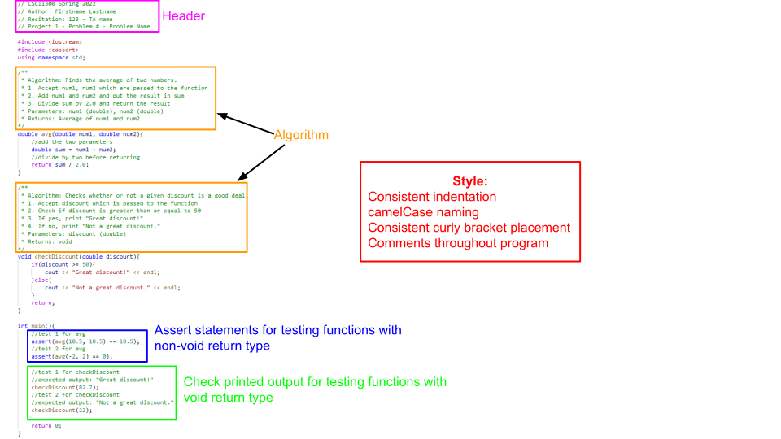

#### **CSCI 1300 CS1: Starting Computing: Homework 6**
#### **Rege - Summer 2022**
#### **Due: Saturday, July 16th, by 11.59pm MST**
<br>

## Table of contents

1. [Homework Summary](#summary)
1. [Objectives](#objectives)
2. [Background](#background)
3. [Testing Functions](#tests)
    * [Void functions with printed output](#void)
    * [Non-void functions returning bool or int](#non-void-bool-int)
    * [Non-void functions returning double](#non-void-double)
    * [Functions manipulating arrays](#test-function-array)
    * [Testing class objects](#test-objects)
4. [Questions](#questions)
    * [Question 0](#q0)
    * [Question 1](#q1)
    * [Question 2](#q2)
    * [Question 3](#q3)
    * [Question 4](#q4)
    * [Extra Credit](#ec1)
5. [Submission Instructions](#submission)
    * [Checklist](#check)
    * [Grading rubric](#rubric)

## Homework Summary <a name="summary"></a>

For this homework, we will be creating a course scheduler to assist students in managing their registration and course enrollments. Question 0 will give you a brief overview of the class you will be creating, and the remaining questions will walk you through implementing each method of the **Scheduler** class. 

## Objectives <a name="objectives"></a>
1. Learn how to work with structs, objects, vectors, and file I/O.

## Background <a name="background"></a>
### **Structures**

In C++, we can define a **structure** using the keyword `struct` like so:

```cpp
struct State{
    string name;
    int area;
};
```

This defines a new type, `State`, that you can use for declaring variables, e.g.

```cpp
//create a State variable with no name or area
State emptyState;

//create a State variable with a name and area
State colorado{"Colorado", 104094};
```

The variables `emptyState` and `colorado` both have two named parts, called **members** - `name` and `area`. We can access each member using dot notation, e.g.

```cpp
//set members for empty State
emptyState.name = "Texas";
emptyState.area = 268596;

//get members for colorado
cout << colorado.name << " has area " << colorado.area << " sqmi." << endl;
```

Expected output:
```
Colorado has area 104094 sqmi.
```

If we want to compare two structs, we cannot do so directly. Instead, we must compare each data member individually to see if they match, e.g.

```cpp
//check each data member by one
if(colorado.name == emptyState.name && colorado.area == emptyState.area){
    cout << "These are the same state!" << endl;
}else{
    cout << "These are not the same state!" << endl;
}
```

Expected output:
```
These are not the same state!
```

### **Structs and Classes**

A class can have a `struct` as a data member, much like how a class could have any other type of data member. It's important to make sure that the class header file (the .h file) can see the definition of the struct. This can be accomplished by defining the struct inside of the .h file, like below:

```cpp
struct State{
    string name;
    int area;
};

class Example{
    private:
        State myState;
        //other data members
    public:
        //setter accepts a State parameter
        void setState(State newState);
        //getter returns a State parameter
        State getState();
        //other member methods
};
```

Any file that includes the .h file shown above will be able to use instances of the `State` struct, so you will not need to define the `State` struct anywhere else.

### **Vectors of Structs**

Much like how we can have vectors of objects, we can also have vectors of structs. We would define a vector of structs like so:
```cpp
struct State{
    string name;
    int area;
};

//create a vector of States
vector<State> myStates;

//add a state to the vector
State newState{"Random State", 123};
myStates.push_back(newState);
```

### **When to Use Structs Versus Classes**

While structs and classes are similar, there are some key differences between them. When deciding whether you should use one over the other, consider the functionality you'd like to achieve. Generally, a good rule of thumb is to ask whether the data type you're defining will need to have any methods or private variables. If it will, then you should create a class. If not, then a struct may be better. 

## Testing functions <a name="tests"></a>

Every C++ program you write should include a main function that tests the function you wrote. 
There will be different types of test cases you will write depending on the return type of the function.
Listed below is how we expect you to test different types of functions. The process will be different for testing a `void` function, non-void functions that return an `int` or `bool`, and non-void functions 
that return a `double`.

#### 1. Void Functions with printed output <a name="void"></a>

For **void** functions that have printed output (i.e. functions that use `cout` to print to the terminal), call the testing function in the main function. Your tests should include the expected output in comments.

See the sample code below:
```c++
void checkDiscount(double discount) {
    if (discount >= 50) {
        cout << "Great discount!" << endl;
    } else {
        cout << "Not a great discount." << endl;
    }
    return;
}
int main() {
    // test 1 for checkDiscount
    // expected output: "Great discount!"
    checkDiscount(82.7);
    
    // test 2 for checkDiscount
    // expected output: "Not a great discount."
    checkDiscount(22);
    
    return 0;
}
```
_* For the purpose of this test code snippet, algorithm comments were not included, but they are still expected in your C++ files._


<br>


#### 2. Non-Void Functions returning bool or int <a name="non-void-bool-int"></a>

For **non-void** functions that return a **bool or int**, use an **assert statement** 
from the **cassert** header (`#include <cassert>`) with a conditional expression.

Assert tests contain a conditional expression which will be true unless there is a bug in the program.
If the conditional expression evaluates to false, then your program will terminate and show an error message.

For the purpose of this project, functions that return a `bool` or `int` can be compared to a specific value using the equality operator `==`.

Your test will look something like this:

`assert(<function call> == <value to compare to>);`

* `<function call>` is where you will call the function you want to test with its function parameters.
* `<value to compare to>` is the value you expect the function to return.
* `==` is the equality operator, and it compares the equality of both sides of itself. 

See the sample code below:
```c++
#include <iostream>
#include <cassert>
using namespace std;
int add_(int num1, int num2)
{
    // add num1 and num2 before returning
    return num1 + num2;
}
// isDrivingAge returns true if the given age passed as a parameter is greater than 16,
// else it returns false.
bool isDrivingAge(int age)
{
    if (age >= 16)
    {
        return true;
    }
    else
    {
        return false;
    }
}
int main()
{
    // test 1 for add_
    assert(add_(5, 6) == 11);
    // test 2 for add_
    assert(add_(10, 10) == 20);
    // test 3 for drivingAge
    assert(isDrivingAge(17) == true);
    // test 4 for drivingAge
    assert(isDrivingAge(14) == false);
}
```
_* For the purpose of this test code snippet, algorithm comments were not included, but they are still expected in your C++ files._

<br>


#### 3. Non-Void Functions returning double <a name="non-void-double"></a>

For **non-void** functions that return a **double**, use an **assert statement**
    from the **cassert** header (`#include <cassert>`) with a conditional expression and include the following function in your program.
```c++
/**
 * doubles_equal will test if two doubles are equal to each other within two decimal places.
 */
bool doubles_equal(double a, double b, const double epsilon = 1e-2)
{
    double c = a - b;
    return c < epsilon && -c < epsilon;
}
```
Because the `double` type holds so much precision, it will be hard to compare the equality of a function that returns a 
double with another double value. To overcome this challenge, we can compare `double` values within a certain range 
of precision or decimal places. The function above compares the equality of two values `a` and `b` up to two decimal places.
This function returns `true` if the values `a` and `b` are equal with each other up to two decimal places.

You will be expected to use this function in conjunction with `assert` statements to test functions that return 
the type double.

Your test will look something like this: 

`assert(doubles_equal(<function call>, <value to compare to>));`

 * `<function call>` is where you will call the function you want to test with its function parameters 
 * `<value to compare to>` is the `double` value you expect the function to return.


See the sample code below:
```c++
#include <iostream>
#include <cassert>
using namespace std;
/**
 * doubles_equal will test if two doubles are equal to each other within two decimal places.
 */
bool doubles_equal(double a, double b, const double epsilon = 1e-2)
{
    double c = a - b;
    return c < epsilon && -c < epsilon;
}
/**
 * reciprocal returns the value of 1 divided by the number passed into the function.
 */
double reciprocal(int num)
{
    return 1.0 / num;
}
int main()
{
    // test 1 for reciprocal
    assert(doubles_equal(reciprocal(6), 0.16));
    // test 2 for reciprocal
    assert(doubles_equal(reciprocal(12), 0.083));
}
```
For test 1, `reciprocal(6)` is being called, and we expect the function to return the value `0.16`. 
The return value of `reciprocal(6)` and `0.16` is passed in as parameters to the `doubles_equals` function,
which will then return `true` if these two values are equal or `false` if they are not.

_* For the purpose of this test code snippet, algorithm comments were not included, but they are still expected in your C++ files._

<br>

#### 4. Functions manipulating arrays <a name="test-function-array"></a>

Functions which manipulate arrays passed as arguments can be tested by asserting on individual elements of the array after calling the function. This works even for `void` functions because arrays are passed by reference; even if the function doesn't return anything, the array in the function is the same array in memory as the one outside the scope of your function.

Note that if the array is an array of `float` or `double`, the `doubles_equal` function described [here](#non-void-double) should be used to assert on individual array elements.

See the sample code below:
```cpp
#include<iostream>
#include<cassert>
using namespace std;

/**
 * Add one to each element of the array. 
 */
void addOneToArrayElements(int arr[], int size) {
    for (int i = 0; i < size; i++) {
        arr[i] = arr[i] + 1;
    }
}
 
int main() {
    // test 1 for addOneToArrayElements
    int test1Arr[3] = {1, 2, 3};
    addOneToArrayElements(test1Arr, 3);
    assert(test1Arr[0] == 2);
    assert(test1Arr[1] == 3);
    assert(test1Arr[2] == 4);
    
    // test 2 for addOneToArrayElements
    int test2Arr[3] = {8, 10};
    addOneToArrayElements(test2Arr, 2);
    assert(test2Arr[0] == 9);
    assert(test2Arr[1] == 11);
}
```
#### 5. Testing class objects <a name="test-objects"></a>
When creating an instance of a class, or an object, the attributes of that object can be tested
by asserting on the individual attributes or data members. 

Note that if the data attribute is a float or double, the doubles_equal function described [here](#non-void-double) 
should be used to assert on the value.

Additionally, note that if the data attribute is an array, follow the ["Functions manipulating arrays" section](#test-function-array) 
on how to assert on individual array elements.

See the sample code below:
```c++
class Animal
{
private:
    string sound;
    string name;
    int age;

public:
    Animal();
    Animal(string, string, int);

    string getSound();
    string getName();
    int getAge();
};

Animal::Animal()
{
    sound = "";
    name = "";
    age = 0;
}

Animal::Animal(string sound_, string name_, int age_)
{
    sound = sound_;
    name = name_;
    age = age_;
}

string Animal::getSound()
{
    return sound;
}

string Animal::getName()
{
    return name;
}

int Animal::getAge()
{
    return age;
}

int main()
{
    Animal defaultDog;
    assert(defaultDog.getSound() == "");
    assert(defaultDog.getAge() == 0);
    assert(defaultDog.getName() == "");

    Animal actualDog("Bark bark!", "Pluto", 2);
    assert(actualDog.getSound() == "Bark bark!");
    assert(actualDog.getAge() == 2);
    assert(actualDog.getName() == "Pluto");
}
```
_* For the purpose of this test code snippet, algorithm comments were not included, but they are still expected in your C++ files._

## Questions <a name="questions"></a>
### **Question 0 (0 points): The <code>Course</code> Struct and <code>Schedule</code> Class** <a name="q0"></a>

First, create a **Course** struct with the members described below. This struct will be used in your **Schedule** class.

**Course Members:**
| Attribute | Description |
| ----- | ----- |
| `string`: number | The Course number, e.g. CSCI 1300 |
| `int`: hours | The Course credit hours |

**Hint:** You should include the definition of the `Course` struct in your `Schedule.h` file. See the [background](#background) section on Structs and Classes for more information.

The following questions will guide you through creating the **Schedule** class, which is described below:

**Data Members (private)**
| Data Members | Description |
| ----- | ----- |
| `string` studentName | The student's name. |
| `int` enrolledHours | The total number of credit hours the student is enrolled in.  |
| `vector<Course>` available | A vector of Courses available for the student to enroll in. |
| `vector<Course>` enrolled | A vector of Courses that the student is enrolled in. |

**Member Functions (public)**
| Member Functions | Description |
| ----- | ----- |
| Parameterized Constructor | Set `studentName` to the `string` parameter and `enrolledHours` to 0.  |
| `getStudentName` | Returns the `studentName` member variable. |
| `getEnrolledHours` | Returns the `enrolledHours` member variable. |
| `loadCourses(string)` | Takes a `string` (the name of the file to be read) and populates the `available` vector with Courses. Returns `true` if the Courses were loaded successfully and `false` otherwise. |
| `displayAvailableCourses()` | Displays the Courses listed in the `available` vector, one per line. Returns `void`. |
| `addCourse(string)` | Takes a `string` (the Course number) and adds the Course to the `enrolled` vector. Returns -1 if the Course does not exist, 0 if the student is already enrolled in the maximum number of hours, and 1 if the student was successfully enrolled in the Course. |
| `dropCourse(string)` | Takes a `string` (the Course number) and removes the Course from the student's enrollment. Returns `false` if the student was not enrolled in the Course or if the Course doesn't exist and `true` otherwise. |
| `writeSchedule(string)` | Takes a `string` (the path to the file) and writes the student's schedule to a file. Returns `false` if the file cannot be opened, and `true` otherwise. |

**Note:** Question 0 serves to describe the Course struct and Schedule class. Specific implementation details for each member method of the Schedule Class will be described below. There is no CodeRunner for this question. 

### **Question 1 (12 points): The <code>Schedule</code> Constructor, <code>getStudentName</code> and <code>getEnrolledHours</code>** <a name="q1"></a>

For this question, you will create three methods for the `Schedule` class. The function specifications are listed below:

**The <code>Schedule</code> constructor**

This constructor will accept one `string` parameter for the student's name, and set `enrolledHours` to 0.

* Accept one parameter:
    * `string`: The name of the student. The data member `studentName` should be set to this parameter.
* Set the `enrolledHours` data member to 0.
* This function will not return anything (because it's a constructor).

**The <code>getStudentName</code> method**

This method should accept no parameters and returns the `studentName` data member.

* Accept no parameters.
* This function returns the `studentName` data member as a `string`.

**The <code>getEnrolledHours</code> method**

This method accepts no parameters and returns the `enrolledHours` data member.

* Accept no parameters.
* This function returns the `enrolledHours` data member as an `int`.

**Example Usage**
```cpp
//create schedule object
Schedule mySched("Good Student");

//test getStudentName method
cout << mySched.getStudentName() << endl;

//test getEnrolledHours method
cout << mySched.getEnrolledHours() << endl;
```

Expected output:
```
Good Student
0
```

**Note:** Although you haven't finished implementing all of the member methods, you should still include them all in your class definition (.h file), and paste the **entire** class definition into the CodeRunner for each question.

When you are done implementing these methods, head on over to Coderunner and paste **all** of your .h file contents and the implementation for **only the three methods you just created** into the answer box. Do not paste in any `#include` directives or `using namespace std;` into the CodeRunner - that's already been included for you. There is nothing to submit to Canvas for this question; you will submit your `Schedule.h` and `Schedule.cpp` files to Canvas once you have finished implementing all of the member methods.


### **Question 2 (16 points): The <code>loadCourses</code> Method** <a name="q2"></a>

For this question you will implement the `loadCourses` member method. This method should:

* Accept one parameter:
    * `string`: The filepath to be read from
* Use `ifstream` and `getline` to read data from the file, creating a new `Course` struct for each line, and put that struct into the `available` member vector.
* Empty lines should not be added to the vector.
* You may assume that each non-empty line will contain valid data, i.e. each non-empty line will consist of a Course number, and the credit hours for that Course, separated by a comma. 
* Assume that Course numbers will have spaces in them, e.g. "CSCI 1300" is a Course number.
* Assume that the txt files provided do **not** have duplicate courses listed. 
* You should use the `stoi()` method to convert the number of credit hours for each Course from a `string` to an `int`.
*  **Hint**: You can use the `split()` function from Homework 5 with a comma (`,`) as the delimiter.
* This function should return:
    * `true` if the file was opened successfully
    * `false` otherwise

We have provided an example [courses.txt](courses.txt) file for you to use while developing your solution. A preview of this file is displayed below:

```
CSCI 1300,4
CSCI 2270,4
CSCI 2400,4
CSCI 3104,4

CSCI 3155,4
CSCI 3308,3
```

**Example Usage**
```cpp
//create schedule object
Schedule mySched("Good Student");

//test return value for a file that doesn't exit
cout << mySched.loadCourses("fakeFile.txt") << endl;

//test return value for a file that does exit
cout << mySched.loadCourses("courses.txt") << endl;
```

Expected output:
```
0
1
```

When you are done implementing this method, head on over to Coderunner and paste **all** of your .h file contents and the implementation for **all of the member methods from questions 1 and 2** into the answer box. Be sure to also include your `split` function in your answer if you need to use it. There is nothing to submit to Canvas for this question; you will submit your `Schedule.h` and `Schedule.cpp` files to Canvas once you have finished implementing all of the member methods.

### **Question 3 (16 points): The <code>addCourse</code> Method** <a name="q3"></a>

For this question you will implement the `addCourse` member method. This method should:

* Accept one parameter:
    * `string`: The Course number to be added to the student's schedule.
* The function should look through the `available` vector to ensure that this Course is available for registration.
    * **Note:** The Course number should be case **insensitive**, e.g. both "CSCI 1300" and "csci 1300" refer to the same Course.
* If the Course is available for registration, the method should add the Course to the `enrolled` data member.
    * Be sure to update the `enrolledHours` data member appropriately!
* **Note:** students may not enroll in more than 15 credit hours. If enrolling in the desired Course would result in the student having more than 15 credit hours, the function should **not** enroll the student in the desired Course. 
* If the student has enrolled in the Course successfully, the Course should be removed from the `available` member vector.
* The function should return one of the following `int` values:
    * -1 if the Course is not available for registration
    * 0 if the Course is available but adding the Course would cause the student to be enrolled in more than 15 credit hours.
    * 1 if the student was successfully enrolled in the Course.

**Example Usage**
```cpp
//create schedule object
Schedule mySched("Good Student");

//load courses
mySched.loadCourses("courses.txt");

//try registering for a course that doesn't exist
cout << mySched.addCourse("not a real course") << endl;

//register for a course that does exist
cout << mySched.addCourse("csci 1300") << endl;

//register for two more courses for a total of 12 enrolled hours
mySched.addCourse("cSci 3575");
mySched.addCourse("CSCI 3104");

//try registering for more than 15 hours
cout << mySched.addCourse("csci 2270") << endl;
```

Expected output:
```
-1
1
0
```

When you are done implementing this method, head on over to Coderunner and paste all of your .h file contents and the implementation for **all of the member methods from questions 1, 2, 3 and 4** into the answer box. Do not paste in any `#include` directives or `using namespace std;` into the CodeRunner - that's already been included for you. There is nothing to submit to Canvas for this question; you will submit your `Schedule.h` and `Schedule.cpp` files to Canvas once you have finished implementing all of the member methods.

### **Question 4 (16 points): The <code>dropCourse</code> Method** <a name="q4"></a>

For this question you will implement the `dropCourse` method. This method should:

* Accept one parameter:
    * `string`: The Course number to be dropped from the student's schedule.
* This function should search through the `enrolled` data member to find the appropriate Course to drop.
    * **Note:** The Course number should be case **insensitive**, e.g. both "CSCI 1300" and "csci 1300" refer to the same Course.
* If the student is currently enrolled in the Course, it should be removed from the `enrolled` data member.
    * Be sure to update the `enrolledHours` data member appropriately!
* Once the Course has been dropped, it should be put back into the `available` data member, so that the student may re-enroll in the Course if desired.
* The function should return one of the following `bool` values:
    * `true` if the Course was dropped successfully.
    * `false` otherwise. This includes the case where the course does not exist at all. 

**Example Usage**
```cpp
//create schedule object
Schedule mySched("Good Student");

//load courses
mySched.loadCourses("courses.txt");

//add a course
mySched.addCourse("csci 1300");

//drop a course that student is not enrolled in 
cout << mySched.dropCourse("math 123") << endl;

//drop a course that the student is enrolled in
cout << mySched.dropCourse("CSCI 1300") << endl;
```

Expected output:
```
0
1
```

When you are done implementing this method, head on over to Coderunner and paste all of your .h file contents and the implementation for **all of the member methods from questions 1, 2, 3, 4 and 5** into the answer box. Do not paste in any `#include` directives or `using namespace std;` into the CodeRunner - that's already been included for you. There is nothing to submit to Canvas for this question; you will submit your `Schedule.h` and `Schedule.cpp` files to Canvas once you have finished implementing all of the member methods.

### **Extra Credit Question(10 points): The <code>writeSchedule</code> Method** <a name="ec"></a>

For this question you will implement the `writeSchedule` member method. This method should:

* Accept one parameter:
    * `string`: The filepath for the output to be saved.
* This function should write the student's current enrolled courses to the file specified by the filepath.
* This method should output the following to the specified txt file:
    *  If the student is not enrolled in any courses, the function should write `<studentName> has not enrolled in any classes.`.
    * Otherwise, the function should write `<studentName> Class Schedule (<enrolledHours> hours):`, followed by the courses the student is enrolled in, one per line.
* This function should return one of the following `bool` values:
    * `true` if the student's schedule was written to the file successfully (regardless of whether or not they are enrolled in any classes).
    * `false` if the file could not be opened.

**Example 1:** Student is registered for one or more classes.
```cpp
//create schedule object
Schedule mySched("Good Student");

//load courses
mySched.loadCourses("courses.txt");

//add a course
mySched.addCourse("csci 1300");

//save schedule
mySched.writeSchedule("mySchedule.txt");
```

Expected contents of `mySchedule.txt`:
```
Good Student Class Schedule (4 hours):
CSCI 1300, 4
```

**Example 2:** Student is **not** registered any classes.
```cpp
//create schedule object
Schedule mySched("Good Student");

//save schedule
mySched.writeSchedule("mySchedule.txt");
```

Expected contents of `mySchedule.txt`:
```
Good Student has not enrolled in any classes.
```

When you are done implementing this method, head on over to Coderunner and paste **the entirety** of your header (Schedule.h) and implementation (Schedule.cpp) files into the answer box. Do not paste in any `#include` directives or `using namespace std;` into the CodeRunner - that's already been included for you. You will submit your (now completed) Schedule.h and Schedule.cpp files to Canvas for this question, along with a scheduleDriver.cpp file that tests out your new Schedule class (See the [testing class objects](#test-objects) section above for more details about how to test your new class).


## Submission Instructions <a name="submission"></a>

### Checklist <a name="check"></a>

Here is a checklist for submitting the assignment:

1.  **CodeRunner**. The correctness of your program will be graded by Coderunner. You can modify your code and re-submit (press “Check” again) as many times as you need to, until the assignment due date. Use the solutions you created in VSCode to complete the assignment on Canvas. 

2.  **C++ files**. When you are finished with all the questions, zip all of your .cpp and .h files together. Submit the single zip file under the assignment **"Homework 6"** on Canvas.
    * All files should be named as specified in each question, and they should compile and run on Coderunner (pass all test cases) and in VSCode to earn full points.
    * Our TAs will be grading the style of your code and comments. Please see the style guide on Canvas for more details.
    * At the top of each file, write your name in the format shown below.
    * Your scheduleDriver.cpp file should contain a main that tests the class member methods you created you wrote, like below. **You should include at least 3 test cases for each member method.** In general, we recommend you try to include as many test cases as you believe are necessary to ensure that your code works properly. Deciding on how many test cases to include is an important skill to learn, since the number of necessary test cases can change between programs. See [testing functions](#tests) for examples demonstrating testing.
    * Please be sure to also include function headers that contain the algorithm implemented within the function, expressed in pseudocode. You will need to include these headers above every member function except for the constructor, `getStudentName`, and `getEnrolledHours`. You can refer to the example below for more details.

    * **Style Example:**



    * The zip file should be named, **hmwk6_lastname.zip**. It should have the following 4 files:    
        * Schedule.cpp
        * Schedule.h
        * scheduleDriver.cpp
        * scheduleMenu.cpp
---

### Homework 6 points summary <a name="rubric"></a>

|Criteria|Points|
|--|--|
| Question 0                  | 0    |
| Question 1                  | 12    |
| Question 2                  | 16    |
| Question 3                  | 16    |
| Question 4                  | 16    |
|Total|60|
| Extra Credit                 | 10    |
