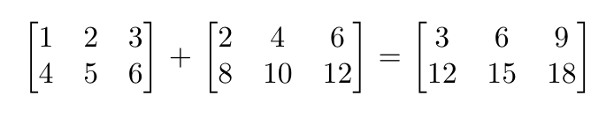

#### **CSCI 1300 CS1: Starting Computing**
#### **Rege - Summer 2022**
#### **Recitation 5 - week of June 27th, 2022**

# Table of contents
1. [Arrays](#arrays)
2. [Exercises](#exercises)
   1. [Pass by pointer](#pointerPass)
   2. [Reverse an array](#reverse)
   3. [Spot the errors](#spot)
   4. [Matrix Sum](#matrix)
3. [Deliverables for Recitation](#deliverables) 

# Arrays <a name="arrays"></a>
Last week in the lecture, we learned about the basics of arrays, their operations, and common algorithms. Today, let’s solve some problems related to arrays.

# Exercises <a name="exercises"></a>

## 1. Pass by pointer:  <a name="pointerPass"></a>
Write a function called ```passByValue()``` which takes two int variables as parameters, increment the first value by 3 and the second value by 2. The function should not return anything.

Write a function called ```passByPointer()``` which takes two int* variables as parameters, dereference the parameters and increment the first value by 3 and second value by 2. The function should not return anything. 

In the main function call the two functions with appropriate arguments.

**Sample Runs**
```
Enter two numbers separated by space: 
2 5
Pass By Value: num1 = 2 num2 = 5
Pass By Pointer: num1 = 5 num2 = 7
```

```
Enter two numbers separated by space: 
1 6
Pass By Value: num1 = 1 num2 = 6
Pass By Pointer: num1 = 4 num2 = 8
```
## 2. Reverse an array! There are two subproblems here: <a name="reverse"></a>
&emsp; a) Write a function called ```swap()``` which takes three parameters: an array, startIndex, and endIndex. This function will swap the values present at the startIndex and endIndex in the given array.

&emsp; b) Write a function called ```reverseArray()``` which takes two parameters: an int array and the length of that array. The function should not return anything as arrays are passed by reference and the values will get changed in place.

&emsp; c) Write a main to initially take in the size of the array, and then instantiate and populate an array with integers by reading the array elements from the user. After creating this array, the main should then call ```reverseArray()``` and print the reversed array.

**RULE**: Do **NOT** use a temporary array. However, you can create just a temporary variable (The reversing operation should be done “in-place”).

*Note*: You can use the swap() function to implement the reverseArray() function. Think about the elements in the array you need to swap to reverse an array in-place

We will assume that the user enters a positive integer greater than 1 as size for the array. Obviously, this is not a foolproof assumption but for the purposes of this recitation, it will suffice.

Here is a function prototype for ```swap```:
```cpp
// this function is to swap two elements in an array
void swap(int myArray[], int index1, int index2);
```

Here is a function prototype for ```reverseArray```:
```cpp
// this function is to reverse all the elements of an array
void reverseArray (int myArray[], int myArrayLength);
```

Example output (**bold** is user input)
<pre><code>Please enter the size of the array:
<b>10</b>
Please enter the elements of the array:
<b>1 2 3 4 5 6 7 8 9 10</b>
The reversed array is:
10 9 8 7 6 5 4 3 2 1
</code></pre>

Implement your solution in C++ using VS Code. Make sure to add at least 3 assertions for reverseArray(). Revise your solution, save, compile and run it again. Are you getting the expected result and output? Keep revising until you do.

<br>

## 3. Spot the errors <a name="spot"></a>
Let's try to spot some common errors and work through these exercises interactively via the Recitation 5 Coderunner on Canvas.

**a)**

```cpp
#include <iostream>
#include <string>
using namespace std;
int main()
{
    double scores[5] = {85.4, 90.3, 100, 89, 74.5, 95};
    double sum = 0;
    for(int i = 0; i < 5; i++){
        sum += scores[i];
    }
    double avg = sum / 5.0;
    cout << "Average = " << avg << endl;
    return 0; 
}
```

**b)**
```cpp
#include <iostream>
using namespace std;

int main()
{
    int temps[N] = {50, 53, 49};
    cout << "The most recently recorded temperature of the day is " << temps[3] << " degrees Fahrenheit." << endl;
    return 0;
}
```
**c)**
```cpp
#include <iostream>
using namespace std;

int main()
{
    int N = 5;
    int colors[] = {"red", "blue", "yellow", "green"};

    //printing all the colors
    for (int i = 0; i < N i++){
        cout << "My favorite color is " << colors[N] << endl
    }
    return 0;
}
```
**d)**
```cpp
#include <iostream>
using namespace std;

int main()
{
    numbers[] = {};
    for(i = 0; i < 10; i++){
        i[numbers] = i + 1;
        Numbers[i] = i + 1
        cout << numbers << endl;
    }

    return 0;
}

```


## 4. Matrix Sum <a name="matrix"></a>




The sum of two matrices is found by adding together corresponding entries in each matrix, as shown above. (For example, the numbers at (row 1, column 1) of each matrix are added together to get the (row 1, column 1) number of the sum matrix.)

<br>
Create a function that takes as parameters two 2 x 3 int arrays, and prints their sum, displayed in two rows.

<br>

Example header:
```cpp
void matrixSum(int a[][3], int b[][3], int row)
```

*Note:* You HAVE to pass the column dimension along with the 2D array when passing it as a parameter to a function. 

You can experiment with trying to remove the column dimension from the function header. It will cause a compilation error.

The row dimension is needed since we need to know when to terminate the loop inside the function. Since both matrices have the same number of rows, we only pass one row parameter.

Then, create a ```main()``` function that asks the user to input the values for each matrix, one row at a time. Store these in two arrays, and pass them to matrixSum.

Example output (**bold** is user input)
<pre><code>Enter values for matrix 1, one row at a time:
<b>1 2 3
4 5 6</b>
Enter values for matrix 2, one row at a time:
<b>2 4 6
8 10 12</b>
The sum is:
3 6 9
12 15 18
</code></pre>

Implement your solution in C++ using VS Code. Revise your solution, save, compile and run it again. Are you getting the expected result and output? Keep revising until you do.
<br>

# Deliverables for Recitation <a name="deliverables"></a>
Complete the Recitation 5 assignment
