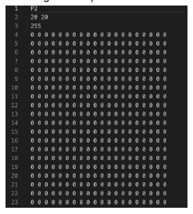
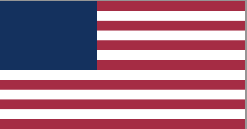

#### **CSCI 1300 CS1: Starting Computing**
#### **Rege - Summer 2022**
#### **Recitation 6 - week of July 4th, 2022**

# Table of contents
1. [Project](#project)
    1. [Writing to file](#filewriting)
    2. [Printing our first image](#first)
2. [Recitation Exercise - Printing Flags](#flag)
3. [Deliverables for Recitation](#deliverables)

## Project <a name="project"></a>
This week in recitation we'll create colored images and get a head start on the Project - Creating Beautiful Images!

### Writing to a file <a name="filewriting"></a>
To write image data to a file, we will use the ‘.pgm’ (black and white image) or ‘.ppm’ (color image) file format.
Essentially, you will write to a file like always but in a particular specified format and with an extension in the file name(.ppm or .pgm). Your computer would then look at the extension of the file and, while opening it, interpret it as an image file. 

The format goes like this:
````
<Code>      # P2 for pgm and P3 for ppm
Width Height    # No of columns and rows in your image separated by a space
255             # This is the value for each pixel in your image, 255 for our purposes
<Pixel values>        # here we start listing pixel values in your image, left to right, top to bottom  
````

### Printing our first image <a name="first"></a>
Lets try to print out a 100x100 image (notice the ‘width’ and ‘height’ variables). We open a file we want to write to. Let’s call it ‘image.pgm’. We use the extension ‘.pgm’ because we want to print out a black and white image right now, to keep things simple. 
Then, we output to the file: the first three lines which need to be included in every ‘.pgm’ file (code, dimensions and maximum pixel intensity). After that, we can start assigning values to every single pixel in our image (there will be 100x100 pixels in our image). 

We just ‘fout’ the value 0 at every pixel location to get an all black image (0 represents black and 255 represents white, everything in between represents shades of gray). Notice there is a space after every pixel value. This is to delineate where one pixel intensity ends and where another begins.
This is what ‘image.pgm’ looks like:



## Recitation Exercise - Printing Flags <a name="flag"></a>
We are printing a colored image of the American Flag for the recitation quiz this week. We are not required to print the stars on the flag. The structure of the flag alternates between red and white stripes with a blue box on the left. 
To build up complexity gently and get a little practice before attempting the quiz, so for the recitation example, we’ll be printing Uruguay flag that is really similar in structure to the American flag. 
Let's break this problem down into subproblems.


The Uruguay Flag has stripes similar to ones on the American Flag. We will be printing only the structure and not the image in the square of the flag. 

#### Step - 1
There are 9 stripes in the flag. Let us start by defining the varibales for number and height for the stripes. 
```cpp
int numStripes = 9;
int h_stripe = 0;

cout << "Enter the height of the strip of pixles"<<endl;
cin >> h_stripe;
```

#### Step - 2
Next we need to define the actual proportions for the stripes of the flag. 
```cpp
​
int h = numStripes * h_stripe;
int w = h * 1.9; //Given 
​
int square = 0.4 * w; 
```

### Step - 3
Our next step would be to write to the file. We are using the ‘.pgm’ (black and white image) or ‘.ppm’ (color image) file format.
You can refer to the [Writing to a file](#filewriting") section to read more. 
```cpp
ofstream fout;
fout.open("output.ppm");
```
You can output the PGM file header on the terminal. 

### Step - 4
Now is the time to write the actual loop for printing the Flag. We'll use a nested loop for printing the stripes. 
You have two for-loops - the outer one going from 0 to height and the inner one going from 0 to width. Inside the loop, you are printing out the loop variables ‘i’ and ‘j’ where you hold ‘i’ constant and vary ‘j’ and then update ‘i’ and repeat the process. 
```cpp
for(int i = 0; i < h; i++)
{
    for(int j = 0; j < w; j++)
    {
        //condition to print white space for the square
        //nested condition to print the stripes for the flag
        fout << endl;
    }
}
```

We have sucessfully printed the Uruguay flag. Let's use this practice to print the American flag.

The final image should look like:



*Note: To obtain complete credit for the problem on Coderunner, you will have to output the RGB values of the pixels in the image on the terminal.*

## Deliverables for Recitation <a name="deliverables"></a>
Complete the Recitation 6 assignment on Canvas.


