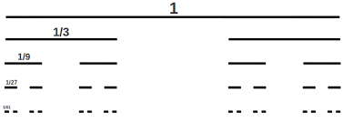
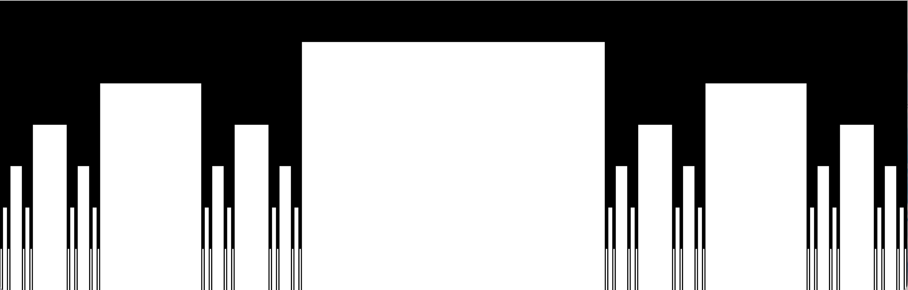
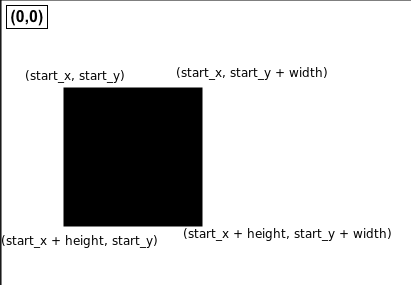

#### **CSCI 1300 CS1: Starting Computing**
#### **Rege - Summer 2022**
#### **Recitation 7 - week of July 11th, 2022**

# Table of contents
1. [Project](#project)
    1. [What is a Connected Cantor Set?](#cantor)
2. [Recitation Exercise - Print the Cantor Set](#printcantor)
3. [Deliverables for Recitation](#deliverables)

## **Project** <a name="project"></a>

For recitation this week, we'll get some practice on Problem-2 in the Project (Sierpinski Carpet). We'll work on a problem which uses a similar approach called the Connected Cantor set. Both these problems use a recursive function to print out the image. 

### **What is a Cantor Set?** <a name="cantor"></a>

A Cantor Set begins with a single segment and is built by removing the middle third of the line segment. This is then repeated with the remaining shorter segments until termination. 



Looking at the image above, we can guess that since we are repeating a set of actions a certain number of times, recursion could be a possible approach for such a problem. 

We will be working on a different version called the Connected Cantor Set. This looks like: 




This looks a lot more exciting, but also a lot more complicated. In reality, it is not! All we need to do is understand how we can print this recursively. Let's try to break down the problem to understand it better. 

Let's assume we are printing out the Connected Cantor Set

- During the first recursion call, the segment is divided into three segments. We then remove the middle segment and are now left with the segments $[0,1/3]$ and $[2/3,1]$.

- Following this, we remove the middle thirds of both of those segments, so we’re left with $[0,1/9]$, $[2/9,1/3]$, $[2/3,7/9]$, and $[8/9,1]$.

- If this process is repeated an infinite number of times, we will end up with the Cantor Set. For our purposes, we will limit the number of recursions to 8. 
---


## **Recitation Exercise** <a name="printcantor"></a>

For this exercise, we will write a program that prints out the Cantor Set with the use of several functions: `cantor`, `paint_empty`, and `display`  

The declarations for the functions are as follows:

```cpp
// Use a power of 3 as width to avoid rounding issues, order 8 max
const int WIDTH = 2187;  // 3^8

void display(char a[][WIDTH], int height, int order, ostream* out) {}

void paint_empty(char a[][WIDTH], int start_y, int height, int start_x, int size, int order){}

void cantor(char a[][WIDTH], int start_y, int height, int start_x, int size, int order) {}


```

- `a[][WIDTH]` is a 2D array for keeping track of pixel values. The width is predefined, as shown above.
- `start_y` is the starting y-coordinate of the line segment.
- `start_x` is the starting x-coordinate of the line segment.
- `height` is the height of the line segment.
- `size` is the width of the current portion of the line segment.
- `order` is the number of iterations or splits of the line segment.
---

### a)char vs. int
In the Connected Cantor Set and the Sierpiński carpet (problem 2 of the project). Why would we want to use char a[][SIZE] instead of int a[][SIZE]?

**Solution**: 
char datatype takes less space in memory than int datatype. Since what we're storing in the array are just 0 and 1 and because we are creating an array of 3^8 in size, we want to make sure memory doesn't bottleneck (reach capacity).
Thus we want to use char datatype.

### b) `display`

This step is used to write the pixel values stored in the 2D array to a PGM file.  Write a function called `display()` as follows:
```cpp
void display(char a[][WIDTH], int height, int order, ostream* out)
```

The function takes in a 2-D array, each cell of which contains some pixel information. It then
loops through a given 2D array and writes the pixel values to the provided output stream. 

*Note that we are passing in the ouput stream as a pointer. When you write to a file, be sure to dereference the pointer*

In this section, we will only be printing out order 0 of the cantor set which is just a black stripe like this. 


The 2D array is initialized as `0` for all cells (every position a[i][j] = 0). You'll have to determine the parameters of the loops to print out the correct height and width of the black stripe.

```cpp
void display(char a[][WIDTH], int height, int order, ostream* out) {
    
    // Logic for outputting the 2D array as pixel values 
}
```

The following image will help you understand how to make the calculation for Height and Width:




Copy your solution and use part A of the recitation 7 to complete the exercise. Be sure to double check that your output image is correct. 
*Note: To obtain complete credit for the problem on Coderunner, you will have to output the RGB values of the pixels.*

**Solution**:
```cpp
void display(char a[][WIDTH], int height, int order, ostream* out) {
    for(int i = 0; i < (height * (order + 1)); i++) {
        for(int j = 0; j < WIDTH; j++) {
            cout << ((int)a[i][j]) << " ";
        }
        cout << endl;
    }
}
```

---

### c) `paint_empty`

We have printed an order 0 Cantor set. Now it's time to understand how to divide this line. When we say 'remove the middle segment', we mean that we'll be printing a white strip for that segment.  
The function which will help us achieve that for the Cantor Set is `paint_empty()`. This function is used to paint the white boxes for each order.

Using the function definition provided for you, create a function that prints out the white boxes in the 2D array with dimensions `height` $*$ `size` and starting at `start_y` and `start_x`. 
*Note: We would want to modify the `display()` function to flip the pixel values for the empty section as by default it would be `0` which corresponds to black*

```cpp
void paint_empty(char a[][WIDTH], int start_y, int height, int start_x, int size, int order){

    // Logic for adding the empty space
}

void cantor_iter(char a[][WIDTH], int start_y, int height, int start_x, int size, int order){
    // Logic to draw cantor set for order 1 only 
}

```

Note that part c you'll need to write the recursive function instead. 

Below is an image of order 1 


Copy your solution and use part B of the recitation 7 Coderunner to test your function, you will need it for the rest of the exercise.

**Solution**:
```cpp
void paint_empty(char a[][WIDTH], int start_y, int height, int start_x, int size, int order) {
    for(int i = start_y; i < start_y + height; i++){
        for (int j = start_x; j < start_x + size; j++){
            a[i][j] = '0';
        }
    }
}
```
---

### d) `cantor`

The process of creating the Cantor set can be described as repeating the segmentation step on all sub-segments until termination. Recursion can capture this process. The function `cantor` is used to perform the segmentation step by setting the middle 1/3 of the segment to be empty and calling itself on the first and last 1/3 of the segment. In these sub-calls, the process is repeated until the provided order is reached.

Write a function that calls itself on the first and last 1/3 of the segment and uses the `paint_empty` function to paint the empty space at the middle 1/3 of the segment. Remember that we're flipping the pixel values in display function, so in the cantor function we want to fill the array (draw the specific blocks) with `1`.

```cpp
void cantor(char a[][WIDTH], int start_y, int height, int start_x, int size, int order) {

    // Logic for creating the Cantor Set
    // Call the function recursively on the first 1/3 of the segment
    // Insert empty space in the middle 1/3 of the segment
    // Call the function recursively on the last 1/3 of the segment
}
```

Copy your solution and use part C of the recitation 7 Coderunner to test your function.

---

**Solution**:
```cpp
void paint_empty(char a[][WIDTH], int start_y, int height, int start_x, int size, int order) {
    for(int i = start_y; i < start_y + height; i++){
        for (int j = start_x; j < start_x + size; j++){
            a[i][j] = '0';
        }
    }
}

void cantor(char a[][WIDTH], int start_y, int height, int start_x, int size, int order) {
    
    if(order == 0) {
        // Set a solid line between certain limits
        for(int i = start_y; i < start_y + height; i++){
            for (int j = start_x; j < start_x + size; j++) {
                a[i][j] = '1';
            }
        }

        return;
    }

    cantor(a, start_y + height, height, start_x, (size/3), order - 1);
    paint_empty(a, start_y + height, height, start_x + (size/3), (size/3), order - 1);
    cantor(a, start_y + height, height, start_x + (2*(size/3)), (size/3), order - 1);

    for(int i = start_y; i < start_y + height; i++){
        for (int j = start_x; j < start_x + size; j++) {
            a[i][j] = '1';
        }
    }
}
```

## Deliverables for Recitation
Complete the Recitation 7 assignment on Canvas. 
